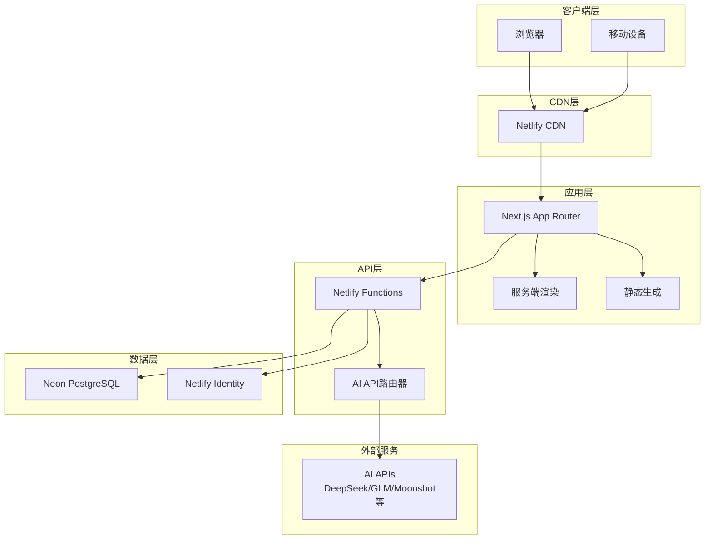
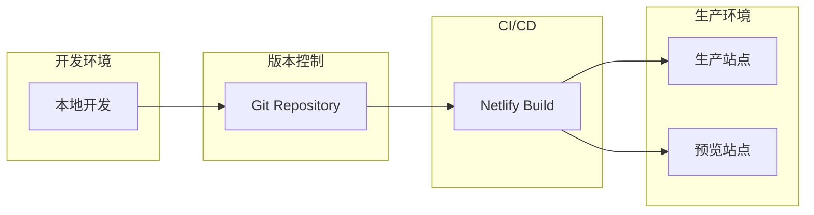
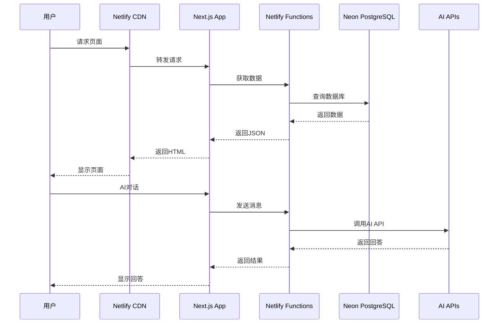
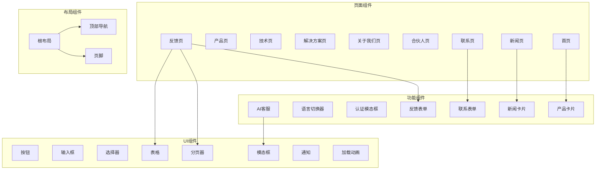
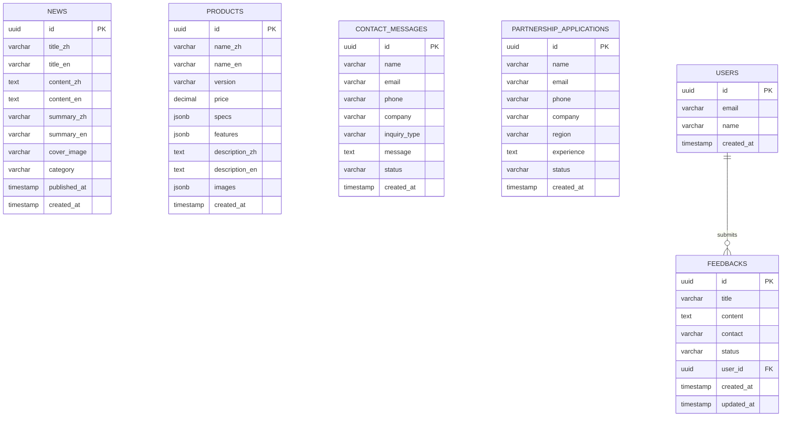

# 微算官方网站设计文档

## Overview


微算官方网站是一个高端商业展示网站,采用现代化的技术栈和国际顶级的设计标准。本设计文档详细说明了系统的架构、组件、数据模型和实现策略。

### 核心目标

1. **高端品牌展示**: 参考苹果官网的设计理念,提供简洁、优雅、专业的用户体验
2. **全球化支持**: 完整的中英文双语系统,支持国际化业务拓展
3. **智能交互**: 集成AI客服系统,提供7x24小时智能问答和页面导航
4. **数据本地化**: 强调"数据不出域"的核心价值,展示微型算力中心的技术优势
5. **商业转化**: 通过清晰的产品展示、解决方案和合伙人体系,促进商业转化

### 技术选型理由

- **Next.js 14+**: 提供优秀的SEO支持(SSR/SSG)、性能优化和开发体验
- **TypeScript**: 确保类型安全,提高代码质量和可维护性
- **Tailwind CSS**: 快速构建响应式UI,保持设计一致性
- **Netlify**: 简化部署流程,提供CDN加速和Serverless Functions
- **Neon PostgreSQL**: 现代化的Serverless数据库,与Netlify深度集成
- **Netlify Identity**: 开箱即用的用户认证,无需自建认证系统

### 设计原则

1. **性能优先**: 首屏加载<3秒,Lighthouse评分>90
2. **SEO优化**: 所有页面支持SSR/SSG,完整的meta标签和结构化数据
3. **渐进增强**: 核心功能在所有浏览器可用,高级特性渐进增强
4. **无障碍访问**: 遵循WCAG AA标准,支持键盘导航和屏幕阅读器
5. **安全第一**: 实施HTTPS、CSRF保护、XSS防护等安全措施

## Architecture

### 系统架构图



### 架构层次说明

#### 1. 客户端层
- 支持现代浏览器(Chrome、Firefox、Safari、Edge最新两个版本)
- 响应式设计,优先支持桌面端(1920px、1440px、1280px)
- 预留移动端适配接口

#### 2. CDN层
- Netlify CDN全球加速
- 静态资源缓存
- 自动HTTPS证书

#### 3. 应用层
- Next.js App Router架构
- 服务端渲染(SSR)用于动态内容
- 静态生成(SSG)用于静态页面
- 客户端水合(Hydration)

#### 4. API层
- Netlify Functions实现Serverless API
- AI API路由器负责多API自动切换
- RESTful API设计

#### 5. 数据层
- Neon PostgreSQL存储业务数据
- Netlify Identity管理用户认证
- 数据库连接池管理

#### 6. 外部服务
- 多个AI API提供商(按优先级自动切换)
- 邮件服务(通过Netlify集成)

### 部署架构



### 数据流架构



## Components and Interfaces

### 组件架构




### 核心组件详细设计

#### 1. 页面组件 (Page Components)

**HomePage (首页)**
- Hero区: 大标题、核心价值主张、CTA按钮
- 产品概览: 三款产品卡片展示
- 核心技术: 存算分离、EBOF全闪存储介绍
- 商业模式: 共享微算模式说明
- 合作伙伴: Logo墙展示
- 新闻动态: 最新3条新闻
- CTA区: 联系我们、成为合伙人

**ProductsPage (产品页)**
- 产品对比表格: 三款产品规格对比
- 产品详情卡片: 每款产品的详细信息
- 技术规格展示: 可展开的技术参数
- 购买咨询入口: CTA按钮

**NewsPage (新闻页)**
- 新闻列表: 卡片布局
- 筛选器: 分类、时间范围、关键词搜索
- 排序器: 按时间正序/倒序
- 分页器: 每页12条

**FeedbackPage (反馈页)**
- 反馈列表: 表格布局
- 筛选器: 时间范围、关键词、状态
- 排序器: 按时间、状态排序
- 分页器: 每页20条
- 提交表单: 标题、内容、联系方式

#### 2. 布局组件 (Layout Components)

**RootLayout (根布局)**
```typescript
interface RootLayoutProps {
  children: React.ReactNode;
  params: { locale: string };
}

// 功能:
// - 设置HTML lang属性
// - 加载全局样式
// - 提供国际化上下文
// - 集成Netlify Identity
```

**Header (顶部导航)**
```typescript
interface HeaderProps {
  locale: string;
}

// 功能:
// - Logo和品牌名称
// - 主导航菜单(首页、产品、技术、解决方案、关于我们、合伙人、新闻、联系)
// - 语言切换器
// - 用户认证状态显示
// - 移动端汉堡菜单
// - 固定定位,滚动时显示阴影
```

**Footer (页脚)**
```typescript
interface FooterProps {
  locale: string;
}

// 功能:
// - 网站地图链接
// - 联系信息
// - 社交媒体链接
// - 版权信息
// - 隐私政策和服务条款链接
```

#### 3. 功能组件 (Feature Components)

**AIChat (AI客服)**
```typescript
interface AIChatProps {
  locale: string;
}

interface Message {
  id: string;
  role: 'user' | 'assistant';
  content: string;
  timestamp: Date;
  links?: Array<{ text: string; url: string }>;
}

// 功能:
// - 悬浮按钮(右下角)
// - 聊天窗口(可展开/收起)
// - 消息列表(用户和AI消息)
// - 输入框和发送按钮
// - 清空对话按钮
// - 加载状态显示
// - 错误处理和重试
// - 会话历史保存(localStorage)
```

**LanguageSwitcher (语言切换器)**
```typescript
interface LanguageSwitcherProps {
  currentLocale: string;
}

// 功能:
// - 显示当前语言
// - 切换到另一种语言
// - 保存语言偏好到localStorage
// - 更新URL路径
```

**FeedbackForm (反馈表单)**
```typescript
interface FeedbackFormProps {
  onSuccess: () => void;
  locale: string;
}

interface FeedbackFormData {
  title: string;
  content: string;
  contact: string;
}

// 功能:
// - 表单字段验证
// - 提交到API
// - 成功/错误提示
// - 提交后清空表单
```

#### 4. UI组件 (UI Components)

**Button (按钮)**
```typescript
interface ButtonProps {
  variant: 'primary' | 'secondary' | 'outline' | 'ghost';
  size: 'sm' | 'md' | 'lg';
  disabled?: boolean;
  loading?: boolean;
  onClick?: () => void;
  children: React.ReactNode;
}
```

**Table (表格)**
```typescript
interface TableProps<T> {
  columns: Array<{
    key: string;
    title: string;
    render?: (value: any, record: T) => React.ReactNode;
    sortable?: boolean;
  }>;
  data: T[];
  loading?: boolean;
  onSort?: (key: string, order: 'asc' | 'desc') => void;
}
```

**Pagination (分页器)**
```typescript
interface PaginationProps {
  current: number;
  total: number;
  pageSize: number;
  onChange: (page: number) => void;
}
```

### API接口设计

#### 反馈相关API

**POST /api/feedback**
```typescript
// 请求
interface CreateFeedbackRequest {
  title: string;
  content: string;
  contact: string;
}

// 响应
interface CreateFeedbackResponse {
  success: boolean;
  data: {
    id: string;
    title: string;
    content: string;
    contact: string;
    status: string;
    created_at: string;
  };
  message: string;
}
```

**GET /api/feedback**
```typescript
// 请求参数
interface GetFeedbacksRequest {
  page?: number;
  pageSize?: number;
  keyword?: string;
  startDate?: string;
  endDate?: string;
  status?: string;
  sortBy?: 'created_at' | 'title' | 'status';
  sortOrder?: 'asc' | 'desc';
}

// 响应
interface GetFeedbacksResponse {
  success: boolean;
  data: Array<{
    id: string;
    title: string;
    content: string;
    contact: string;
    status: string;
    created_at: string;
  }>;
  pagination: {
    page: number;
    pageSize: number;
    total: number;
    totalPages: number;
  };
}
```


#### 新闻相关API

**GET /api/news**
```typescript
// 请求参数
interface GetNewsRequest {
  page?: number;
  pageSize?: number;
  category?: 'company' | 'industry' | 'tech';
  keyword?: string;
  startDate?: string;
  endDate?: string;
  sortOrder?: 'asc' | 'desc';
  locale: string;
}

// 响应
interface GetNewsResponse {
  success: boolean;
  data: Array<{
    id: string;
    title: string;
    summary: string;
    cover_image: string;
    category: string;
    published_at: string;
  }>;
  pagination: {
    page: number;
    pageSize: number;
    total: number;
    totalPages: number;
  };
}
```

**GET /api/news/:id**
```typescript
// 响应
interface GetNewsDetailResponse {
  success: boolean;
  data: {
    id: string;
    title: string;
    content: string;
    summary: string;
    cover_image: string;
    category: string;
    published_at: string;
    related_news: Array<{
      id: string;
      title: string;
      summary: string;
      cover_image: string;
    }>;
  };
}
```

#### 产品相关API

**GET /api/products**
```typescript
// 响应
interface GetProductsResponse {
  success: boolean;
  data: Array<{
    id: string;
    name: string;
    version: string;
    price: number;
    specs: Record<string, any>;
    features: string[];
    description: string;
    images: string[];
  }>;
}
```

#### AI客服API

**POST /api/ai-chat**
```typescript
// 请求
interface AIChatRequest {
  message: string;
  locale: string;
  history?: Array<{
    role: 'user' | 'assistant';
    content: string;
  }>;
}

// 响应
interface AIChatResponse {
  success: boolean;
  data: {
    message: string;
    links?: Array<{
      text: string;
      url: string;
    }>;
    api_used: string; // 使用的AI API名称
  };
}

// AI API路由器逻辑
const AI_APIS = [
  'DeepSeek',
  'GLM',
  'Moonshot',
  'TONGYI',
  'Tencent',
  'SPARK',
  'DOUBAO',
  'Anthropic',
  'Gemini',
  'Deepai'
];

// 按优先级尝试,失败则切换到下一个
```

#### 联系表单API

**POST /api/contact**
```typescript
// 请求
interface ContactRequest {
  name: string;
  email: string;
  phone?: string;
  company?: string;
  inquiry_type: string;
  message: string;
}

// 响应
interface ContactResponse {
  success: boolean;
  message: string;
}
```

#### 合伙人申请API

**POST /api/partnership**
```typescript
// 请求
interface PartnershipRequest {
  name: string;
  email: string;
  phone: string;
  company?: string;
  region: string;
  experience?: string;
}

// 响应
interface PartnershipResponse {
  success: boolean;
  message: string;
}
```

### 状态管理设计

使用React Context + Zustand进行状态管理:

```typescript
// 全局状态
interface GlobalState {
  // 用户状态
  user: {
    id: string | null;
    email: string | null;
    isAuthenticated: boolean;
  };
  
  // 语言状态
  locale: string;
  
  // AI客服状态
  aiChat: {
    isOpen: boolean;
    messages: Message[];
    isLoading: boolean;
  };
  
  // UI状态
  ui: {
    isMobileMenuOpen: boolean;
    toast: {
      show: boolean;
      message: string;
      type: 'success' | 'error' | 'info';
    };
  };
}

// Actions
interface GlobalActions {
  setUser: (user: GlobalState['user']) => void;
  setLocale: (locale: string) => void;
  toggleAIChat: () => void;
  addAIMessage: (message: Message) => void;
  clearAIMessages: () => void;
  showToast: (message: string, type: string) => void;
  hideToast: () => void;
}
```

## Data Models

### 数据库设计

#### ER图



### 表结构详细设计

#### feedbacks表

```sql
CREATE TABLE feedbacks (
    id UUID PRIMARY KEY DEFAULT gen_random_uuid(),
    title VARCHAR(200) NOT NULL,
    content TEXT NOT NULL,
    contact VARCHAR(100) NOT NULL,
    status VARCHAR(20) DEFAULT 'pending' CHECK (status IN ('pending', 'processing', 'resolved')),
    user_id UUID REFERENCES users(id) ON DELETE SET NULL,
    created_at TIMESTAMP DEFAULT NOW(),
    updated_at TIMESTAMP DEFAULT NOW()
);

-- 索引
CREATE INDEX idx_feedbacks_created_at ON feedbacks(created_at DESC);
CREATE INDEX idx_feedbacks_status ON feedbacks(status);
CREATE INDEX idx_feedbacks_user_id ON feedbacks(user_id);

-- 触发器: 自动更新updated_at
CREATE OR REPLACE FUNCTION update_updated_at_column()
RETURNS TRIGGER AS $$
BEGIN
    NEW.updated_at = NOW();
    RETURN NEW;
END;
$$ language 'plpgsql';

CREATE TRIGGER update_feedbacks_updated_at BEFORE UPDATE ON feedbacks
FOR EACH ROW EXECUTE FUNCTION update_updated_at_column();
```

#### news表

```sql
CREATE TABLE news (
    id UUID PRIMARY KEY DEFAULT gen_random_uuid(),
    title_zh VARCHAR(200) NOT NULL,
    title_en VARCHAR(200) NOT NULL,
    content_zh TEXT NOT NULL,
    content_en TEXT NOT NULL,
    summary_zh VARCHAR(500) NOT NULL,
    summary_en VARCHAR(500) NOT NULL,
    cover_image VARCHAR(500) NOT NULL,
    category VARCHAR(50) NOT NULL CHECK (category IN ('company', 'industry', 'tech')),
    published_at TIMESTAMP NOT NULL,
    created_at TIMESTAMP DEFAULT NOW()
);

-- 索引
CREATE INDEX idx_news_published_at ON news(published_at DESC);
CREATE INDEX idx_news_category ON news(category);
CREATE INDEX idx_news_category_published ON news(category, published_at DESC);

-- 全文搜索索引
CREATE INDEX idx_news_title_zh_fts ON news USING gin(to_tsvector('chinese', title_zh));
CREATE INDEX idx_news_title_en_fts ON news USING gin(to_tsvector('english', title_en));
CREATE INDEX idx_news_content_zh_fts ON news USING gin(to_tsvector('chinese', content_zh));
CREATE INDEX idx_news_content_en_fts ON news USING gin(to_tsvector('english', content_en));
```


#### products表

```sql
CREATE TABLE products (
    id UUID PRIMARY KEY DEFAULT gen_random_uuid(),
    name_zh VARCHAR(100) NOT NULL,
    name_en VARCHAR(100) NOT NULL,
    version VARCHAR(20) NOT NULL CHECK (version IN ('B', 'P', 'E')),
    price DECIMAL(10,2) NOT NULL,
    specs JSONB NOT NULL,
    features JSONB NOT NULL,
    description_zh TEXT NOT NULL,
    description_en TEXT NOT NULL,
    images JSONB NOT NULL,
    created_at TIMESTAMP DEFAULT NOW(),
    UNIQUE(version)
);

-- 索引
CREATE INDEX idx_products_version ON products(version);

-- JSONB索引用于查询specs和features
CREATE INDEX idx_products_specs ON products USING gin(specs);
CREATE INDEX idx_products_features ON products USING gin(features);
```

#### contact_messages表

```sql
CREATE TABLE contact_messages (
    id UUID PRIMARY KEY DEFAULT gen_random_uuid(),
    name VARCHAR(100) NOT NULL,
    email VARCHAR(100) NOT NULL,
    phone VARCHAR(20),
    company VARCHAR(200),
    inquiry_type VARCHAR(50) NOT NULL,
    message TEXT NOT NULL,
    status VARCHAR(20) DEFAULT 'new' CHECK (status IN ('new', 'processing', 'resolved')),
    created_at TIMESTAMP DEFAULT NOW()
);

-- 索引
CREATE INDEX idx_contact_messages_created_at ON contact_messages(created_at DESC);
CREATE INDEX idx_contact_messages_status ON contact_messages(status);
CREATE INDEX idx_contact_messages_email ON contact_messages(email);
```

#### partnership_applications表

```sql
CREATE TABLE partnership_applications (
    id UUID PRIMARY KEY DEFAULT gen_random_uuid(),
    name VARCHAR(100) NOT NULL,
    email VARCHAR(100) NOT NULL,
    phone VARCHAR(20) NOT NULL,
    company VARCHAR(200),
    region VARCHAR(100) NOT NULL,
    experience TEXT,
    status VARCHAR(20) DEFAULT 'pending' CHECK (status IN ('pending', 'reviewing', 'approved', 'rejected')),
    created_at TIMESTAMP DEFAULT NOW()
);

-- 索引
CREATE INDEX idx_partnership_applications_created_at ON partnership_applications(created_at DESC);
CREATE INDEX idx_partnership_applications_status ON partnership_applications(status);
CREATE INDEX idx_partnership_applications_email ON partnership_applications(email);
CREATE INDEX idx_partnership_applications_region ON partnership_applications(region);
```

### 数据模型TypeScript定义

```typescript
// Feedback模型
interface Feedback {
  id: string;
  title: string;
  content: string;
  contact: string;
  status: 'pending' | 'processing' | 'resolved';
  user_id: string | null;
  created_at: Date;
  updated_at: Date;
}

// News模型
interface News {
  id: string;
  title_zh: string;
  title_en: string;
  content_zh: string;
  content_en: string;
  summary_zh: string;
  summary_en: string;
  cover_image: string;
  category: 'company' | 'industry' | 'tech';
  published_at: Date;
  created_at: Date;
}

// Product模型
interface Product {
  id: string;
  name_zh: string;
  name_en: string;
  version: 'B' | 'P' | 'E';
  price: number;
  specs: {
    cpu?: string;
    memory?: string;
    storage?: string;
    network?: string;
    [key: string]: any;
  };
  features: string[];
  description_zh: string;
  description_en: string;
  images: string[];
  created_at: Date;
}

// ContactMessage模型
interface ContactMessage {
  id: string;
  name: string;
  email: string;
  phone?: string;
  company?: string;
  inquiry_type: string;
  message: string;
  status: 'new' | 'processing' | 'resolved';
  created_at: Date;
}

// PartnershipApplication模型
interface PartnershipApplication {
  id: string;
  name: string;
  email: string;
  phone: string;
  company?: string;
  region: string;
  experience?: string;
  status: 'pending' | 'reviewing' | 'approved' | 'rejected';
  created_at: Date;
}
```

### 数据验证Schema (Zod)

```typescript
import { z } from 'zod';

// Feedback验证
export const FeedbackSchema = z.object({
  title: z.string().min(1).max(200),
  content: z.string().min(10).max(5000),
  contact: z.string().email().or(z.string().regex(/^1[3-9]\d{9}$/))
});

// News验证
export const NewsSchema = z.object({
  title_zh: z.string().min(1).max(200),
  title_en: z.string().min(1).max(200),
  content_zh: z.string().min(1),
  content_en: z.string().min(1),
  summary_zh: z.string().min(1).max(500),
  summary_en: z.string().min(1).max(500),
  cover_image: z.string().url(),
  category: z.enum(['company', 'industry', 'tech']),
  published_at: z.date()
});

// Contact验证
export const ContactSchema = z.object({
  name: z.string().min(1).max(100),
  email: z.string().email(),
  phone: z.string().regex(/^1[3-9]\d{9}$/).optional(),
  company: z.string().max(200).optional(),
  inquiry_type: z.string().min(1),
  message: z.string().min(10).max(2000)
});

// Partnership验证
export const PartnershipSchema = z.object({
  name: z.string().min(1).max(100),
  email: z.string().email(),
  phone: z.string().regex(/^1[3-9]\d{9}$/),
  company: z.string().max(200).optional(),
  region: z.string().min(1).max(100),
  experience: z.string().max(2000).optional()
});
```

### 数据访问层设计

使用Repository模式封装数据访问:

```typescript
// FeedbackRepository
class FeedbackRepository {
  async create(data: CreateFeedbackDTO): Promise<Feedback>;
  async findById(id: string): Promise<Feedback | null>;
  async findAll(filters: FeedbackFilters): Promise<PaginatedResult<Feedback>>;
  async update(id: string, data: UpdateFeedbackDTO): Promise<Feedback>;
  async delete(id: string): Promise<void>;
}

// NewsRepository
class NewsRepository {
  async findAll(filters: NewsFilters): Promise<PaginatedResult<News>>;
  async findById(id: string): Promise<News | null>;
  async findRelated(id: string, limit: number): Promise<News[]>;
  async search(keyword: string, locale: string): Promise<News[]>;
}

// ProductRepository
class ProductRepository {
  async findAll(): Promise<Product[]>;
  async findById(id: string): Promise<Product | null>;
  async findByVersion(version: string): Promise<Product | null>;
}
```

### 国际化数据处理

对于包含中英文的数据,使用辅助函数根据locale返回对应语言:

```typescript
function getLocalizedNews(news: News, locale: string) {
  return {
    id: news.id,
    title: locale === 'zh' ? news.title_zh : news.title_en,
    content: locale === 'zh' ? news.content_zh : news.content_en,
    summary: locale === 'zh' ? news.summary_zh : news.summary_en,
    cover_image: news.cover_image,
    category: news.category,
    published_at: news.published_at,
    created_at: news.created_at
  };
}

function getLocalizedProduct(product: Product, locale: string) {
  return {
    id: product.id,
    name: locale === 'zh' ? product.name_zh : product.name_en,
    description: locale === 'zh' ? product.description_zh : product.description_en,
    version: product.version,
    price: product.price,
    specs: product.specs,
    features: product.features,
    images: product.images,
    created_at: product.created_at
  };
}
```

