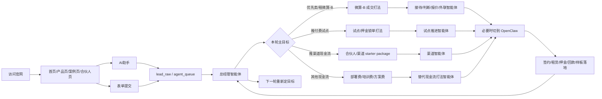
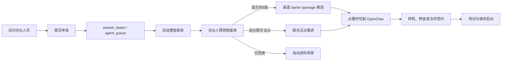

# 微算 AI 总经理智能体全自动经营方案

## 1. 文档目的

本文档用于把微算官网从“品牌展示网站”升级为“由总经理智能体主导的全自动经营系统”。方案基于当前已上线官网、`微算产品宣传册`、`共享微算商业计划书` 以及现有代码结构设计，重点解决以下问题：

- 没有专职销售人员，官网必须承担销售前台能力。
- AI 不能只做客服，必须形成“总经理智能体 + 执行智能体”的经营体系。
- 线索不能只停留在页面提交成功，必须进入结构化数据库和商机流转系统。
- 不能依赖人工打开 AI 工具操作，所有 AI 销售动作必须由系统自动触发和自动执行。
- 不是“人提任务，智能体执行”，而是由总经理智能体主动制定目标、拆解任务、监督执行和追求结果。
- 核心经营目标不是单纯完成任务，而是优先把 `微算-B` 卖出去、租出去，或者找到别的路径实现微算项目正向现金流。
- 如果某些动作无法通过 API 或普通后端任务全自动完成，则必须改由 OpenClaw 执行浏览器 / 桌面级自动化。

本文档同时给出：

- 开发排期表，按 2 周、4 周、8 周拆工期。
- 总经理智能体的目标设定、复盘、重规划机制。
- `0 */8 * * *` 的 8 小时自动经营周期。
- 接口设计清单。
- 字段级数据库 SQL 草案。
- 每个页面的文案与交互改造建议。

## 2. 当前系统基线

### 2.1 已有基础

当前官网已具备较好的内容和导航基础：

- 首页：`app/page.tsx`
- 产品中心：`app/products/page.tsx`
- 产品详情页：`app/products/[slug]/page.tsx`
- 降本案例页：`app/case-study/page.tsx`
- 行业解决方案页：`app/solutions/page.tsx`
- 技术页：`app/technology/page.tsx`
- 关于页：`app/about/page.tsx`
- 合伙人页：`app/partnership/page.tsx`
- 联系页：`app/contact/page.tsx`
- AI 助手：`components/AIChatbot.tsx`
- AI 对话接口：`app/api/ai-chat/route.ts`
- 产品和融资口径：`lib/product-catalog.ts`

### 2.2 当前主要问题

当前代码能支撑展示，但不能支撑销售闭环：

1. 联系表单为前端模拟提交，未真实入库。
2. 合伙人申请没有独立接口与筛选机制。
3. AI 助手当前更接近“客服加导航”，没有资格判断、评分、转商机能力。
4. 数据库仍是占位实现，`lib/db.ts` 尚未接入真实数据层。
5. 仓库中目前只有 `app/api/ai-chat/route.ts`，缺少 `contact`、`partnership`、`lead-score`、`events` 等核心销售接口。
6. 没有线索评分、商机状态、自动提醒、会前 briefing、会后纪要等销售自动化能力。

### 2.3 技术落地前提

基于当前仓库现状，MVP 阶段建议采用：

- 数据库：Neon PostgreSQL。
- 数据访问：先用 SQL 或轻量 DB 封装，暂不强依赖 Prisma。
- 接口层：Next.js Route Handlers，目录为 `app/api/**/route.ts`。
- 调度器：Netlify Scheduled Functions 或等价定时器，固定执行 `0 */8 * * *`。
- 控制平面：总经理智能体 `general_manager_agent` 作为最高决策层。
- 智能体编排：统一由服务端 `orchestrator` 调度，但任务的发起、优先级和重排由总经理智能体决定。
- 执行引擎：优先使用 LLM API + 后端任务；若动作依赖浏览器 / 桌面操作，则切换到 OpenClaw worker。
- 队列与状态：新增 `agent_runs`、`agent_tasks`、`outbound_jobs`、`scheduler_locks`、`business_objectives`、`gm_decisions`、`cashflow_snapshots` 等表。
- 通知：企业微信机器人或飞书机器人。
- 分析：GA4、Clarity 和内部 `page_events`。
- 编排：服务端调度优先，后续可接入 n8n，但 n8n 只是调度层，不是人工操作层。

这样最符合当前项目现状，也最容易以“总经理智能体每 8 小时主动经营一次”的方式快速上线。

## 3. 总体目标与业务原则

### 3.1 90 天业务目标

| 指标 | 目标 |
| --- | ---: |
| 微算-B 销售或租赁签约 | 12 |
| 微算-B 付费试点 / POC | 8 |
| 正向现金流月份 | 至少 1 个 |
| 可重复现金流打法 | 3 条 |
| A/B 类销售线索 | 60 |
| 深度需求访谈 | 20 |
| 正式方案或测算输出 | 20 |
| 可公开标杆案例 | 1 |
| 进入评审的合伙人 | 5 |
| 正式签约合伙人 | 2 |

### 3.2 AI 销售系统原则

1. 总经理智能体是最高经营决策者，所有执行智能体、调度器、外联任务和 OpenClaw worker 都只接受总经理智能体下发的目标和指令。
2. 总经理智能体不是被动等待人分配任务，而是主动读取经营状态、设定目标、拆任务、盯结果和做策略切换。
3. 所有线索必须先进入系统，再进入总经理智能体的经营视野，不允许靠人手动转发给 AI。
4. 基础节奏固定为每 8 小时自动触发一次经营周期，必要时再叠加高优先级即时运行。
5. `微算-B 销售 / 融资租赁 / 付费试点` 是第一现金流优先级，`降本案例` 是第二说服抓手，`合伙人计划` 是第三放大引擎。
6. 如果普通 API 工作流无法完成闭环，则改由 OpenClaw 执行浏览器 / 桌面自动化。
7. 所有页面必须有明确的销售动作，不做纯展示页；所有销售动作必须可审计、可重试、可回放。

### 3.3 总经理智能体的经营北极星

总经理智能体每一轮经营周期都只围绕一个北极星问题工作：

`未来 8 小时，怎么最有可能让微算-B 卖出去、租出去，或者至少形成更接近正向现金流的动作？`

优先级顺序：

1. 直接卖出 `微算-B`。
2. 促成 `微算-B` 融资租赁签约。
3. 促成 `微算-B` 付费试点或押金锁单。
4. 推出 `微算-B + 部署服务 / 培训服务 / 行业样板包` 的付费组合。
5. 推动合伙人或渠道先拿样机、先签区域 starter package。
6. 若以上都暂时不成立，则改推能尽快回款的替代路径，例如算力试用套餐、联合方案费、售前评估费、行业 Demo 搭建费。

这意味着：

- 总经理智能体关注的是经营目标，不是任务完成率本身。
- 如果一条销售路径连续两个经营周期没有产出，总经理智能体必须主动切换打法。
- 总经理智能体不以“回复了多少消息”为成功，而以“离现金流更近了多少”为成功。

## 4. 目标架构

### 4.1 总经理智能体主导的角色分工

| 角色 | 系统承担方式 | 职责 |
| --- | --- | --- |
| 总经理智能体 | `general_manager_agent` | 定经营目标、选现金流路径、拆任务、调优先级、做复盘 |
| 官网接待智能体 | AI 助手加页面弹层 | 首次答疑、意图识别、引导留资 |
| 资格判断智能体 | 评分规则加 LLM 提取 | 收集行业、预算、时间、场景 |
| 报价与方案智能体 | 产品知识库加案例知识库 | 推荐产品、报价路径、方案摘要、案例摘要 |
| 成交推进智能体 | 自动化任务队列 | 发资料、追问、催预约、推进签约和押金 |
| 渠道与合伙人智能体 | 合伙人库加城市资源画像 | 找渠道、筛伙伴、推动样机和 starter package |
| 经营复盘智能体 | 数据库加 Dashboard | 看板、来源归因、现金流复盘、异常发现 |
| OpenClaw 执行智能体 | OpenClaw worker | 执行不能靠 API 直连完成的浏览器 / 桌面任务 |

说明：

- 本方案中的“全自动运行”指销售系统内部的采集、判断、生成、触达、跟进、复盘、策略切换全部由总经理智能体及其下属智能体完成。
- 合同签署、回款、设备发货属于业务世界动作，不属于 AI 系统内部运行逻辑。
- 人只负责设置经营边界，例如价格底线、库存约束、品牌口径；不负责逐条给智能体派活。

### 4.2 客户销售流程



### 4.3 合伙人流程



### 4.4 总经理智能体的 8 小时经营例会机制

固定运行节奏：

- 定时表达式：`0 */8 * * *`。
- 默认每天运行 3 次，例如 `00:00`、`08:00`、`16:00`。
- 每次运行都必须由总经理智能体先读取经营面板，再写入一条 `agent_runs` 记录，并对本轮执行结果做摘要。

单轮运行步骤：

1. 调度器调用 `/api/agent/run`。
2. 系统先抢占 `scheduler_locks`，避免重复并发运行。
3. 总经理智能体读取 `lead_raw`、`page_events`、`opportunities`、`partner_leads`、`cashflow_snapshots`。
4. 总经理智能体选出本轮主目标，例如“本轮必须推进 1 个微算-B 融资租赁签约”。
5. 总经理智能体选择策略路径，并生成 `gm_decisions` 记录。
6. 总经理智能体把目标拆成 `agent_tasks`，再分发给下属执行智能体。
7. 下属智能体执行过程中把输入、输出、状态、异常写入 `agent_tasks`。
8. 若某个任务需要网页登录后台、发邮件后台操作或抓取页面，则总经理智能体自动派给 OpenClaw。
9. 本轮执行完成后，总经理智能体输出经营复盘并推送到企业微信 / 飞书。
10. 失败任务进入重试队列；连续失败两轮后，总经理智能体必须切换打法。

补充规则：

- A 类线索、明确留资、明确报价需求可触发“即时运行”，但仍然会在下一轮 8 小时任务中再次汇总。
- 任何对外发送行为都必须先写 `outbound_jobs`，禁止由智能体直接绕过队列发送。
- 如果本轮没有产生更接近现金流的动作，总经理智能体必须在复盘里写明原因和下一轮修正策略。

### 4.5 总经理智能体的现金流策略树

总经理智能体在每轮经营周期中，按如下顺序选择策略：

| 优先级 | 现金流策略 | 适用情形 |
| --- | --- | --- |
| 1 | `微算-B 融资租赁` | 客户预算有限，但能快速启动 |
| 2 | `微算-B 直接销售` | 客户预算明确、决策链短 |
| 3 | `微算-B 付费试点 / POC` | 客户还不能立刻签整单，但可付试点费用或押金 |
| 4 | `微算-B + 服务包` | 客户愿意先付部署费、培训费、顾问费 |
| 5 | `合伙人 starter package` | 渠道方可先拿样机、先锁区域、先付合作款 |
| 6 | `替代正现金流路径` | 以上路径都受阻时，转推方案费、评估费、联合 demo 费、短租算力包 |

切换规则：

- 如果直接销售与租赁都推进缓慢，总经理智能体应主动把目标切换到“先拿到付费试点或押金”。
- 如果单客户转化慢，总经理智能体应提高渠道和合伙人路径优先级。
- 如果高客单路径周期太长，总经理智能体应主动推短周期现金流产品。

### 4.6 OpenClaw 兜底执行架构

适用场景：

- 某些渠道没有可直接调用的 API。
- 需要登录浏览器后台、执行多步网页操作、上传文件、读取页面内容。
- 需要在无人值守环境下完成“像人一样操作浏览器”的动作。

执行策略：

- 优先路线：`LLM API + 内部任务队列 + 结构化接口`。
- 兜底路线：`OpenClaw worker`。
- 一旦某个动作被标记为 `requires_browser` 或 `requires_desktop`，调度器直接把任务分发给 OpenClaw，而不是等待人工去操作。

架构要求：

- OpenClaw 运行在独立 worker 或独立虚拟机中。
- 所有 OpenClaw 任务必须从系统任务表生成，不允许人工手工点开执行。
- OpenClaw 执行结果必须回写 `agent_tasks`、`outbound_jobs` 和审计日志。
- 凭证必须放入安全密钥管理，不可写死在仓库中。

## 5. 功能清单

### 5.1 P0 必须具备

1. 联系表单真实入库并进入智能体队列。
2. 合伙人表单真实入库并进入智能体队列。
3. 总经理智能体 `general_manager_agent`。
4. 8 小时经营周期调度器。
5. 总经理智能体决策表 `gm_decisions`。
6. 现金流快照 `cashflow_snapshots`。
7. AI 销售资格判断。
8. 自动线索评分。
9. AI 对话转线索。
10. 新线索通知与自动外联队列。
11. CTA 埋点与来源追踪。
12. 商机工作台 MVP。
13. 自动首轮资料发送。
14. `agent_runs`、`agent_tasks`、`scheduler_locks` 审计链路。
15. `微算-B` 的销售、租赁、试点三套经营剧本。

### 5.2 P1 增强项

1. AI 推荐产品与方案。
2. AI 推荐降本案例。
3. AI 自动预约引导。
4. AI 会前 briefing。
5. AI 会后纪要。
6. B/C 类线索多轮自动培育。
7. 合伙人自动评估。
8. 失单原因与商机卡点分析。
9. OpenClaw worker 接入。
10. 知识库与资料包每 8 小时自动刷新。
11. 总经理智能体自动切换经营策略。
12. 总经理智能体自动选择“卖 B / 租 B / 试点 / 其他现金流”路径。

### 5.3 P2 放大项

1. AI 方案初稿生成。
2. ROI/TCO 自动测算摘要。
3. 案例库与销售知识库后台。
4. 区域合伙人城市评估面板。
5. 多渠道工单统一，覆盖微信、邮箱、表单。
6. 管理层 BI 看板。
7. OpenClaw 全渠道自动执行。
8. 销售日报 / 周报 / 异常告警全自动生成。
9. 总经理智能体的长期经营记忆与策略学习。
10. 基于现金流结果的自动预算与优先级再分配。

## 6. 开发排期表

### 6.1 前 2 周：总经理智能体底座跑通

目标：让官网从展示站变成“由总经理智能体每 8 小时主动经营一次”的现金流入口。

| 周期 | 模块 | 任务 | 结果 |
| --- | --- | --- | --- |
| 第 1 周 | 数据层 | 建库、建表、封装 DB 访问层 | 可真实存线索 |
| 第 1 周 | 决策层 | 新增 `general_manager_agent`、`gm_decisions`、`business_objectives` | 有最高经营控制层 |
| 第 1 周 | 调度层 | 新增 `0 */8 * * *` 定时调度器与 `/api/agent/run` | 系统开始定时运行 |
| 第 1 周 | 队列表 | 新增 `agent_runs`、`agent_tasks`、`scheduler_locks`、`cashflow_snapshots` | 执行链可追踪 |
| 第 1 周 | 联系页 | 改真实提交、字段补全、错误处理 | 真实入库 |
| 第 1 周 | 合伙人页 | 新增真实申请接口并入库 | 渠道线可独立收集 |
| 第 1 周 | AI 助手 | 增加资格判断问题流 | AI 开始筛客 |
| 第 2 周 | 后端 | 新增 `/api/contact`、`/api/partnership`、`/api/lead-score`、`/api/agent/run` | 基础 API 就绪 |
| 第 2 周 | 评分 | 自动评分规则、A/B/C 分层 | 高意向客户可筛出 |
| 第 2 周 | 现金流剧本 | 新增 `微算-B 销售`、`微算-B 租赁`、`微算-B 试点` 三套经营剧本 | 总经理智能体有优先打法 |
| 第 2 周 | 外联 | 自动首轮资料发送与任务入列 | 无人值守首轮跟进 |
| 第 2 周 | 埋点 | CTA、页面来源、AI 首次打开等埋点 | 能统计来源 |
| 第 2 周 | 后台 | 简易商机看板加总经理决策看板 | 每天可看重点线索和经营状态 |
| 第 2 周 | OpenClaw | 预留执行器接口与 worker 骨架 | 浏览器自动化可接入 |

#### 2 周验收标准

- 联系表单和合伙人表单都能落库。
- AI 对话能产生结构化意向字段。
- 每 8 小时会自动生成一轮 `agent_runs`。
- 每 8 小时会自动生成一条 `gm_decisions`。
- A/B/C 类线索会自动进入不同任务队列。
- 不需要人工打开 AI 工具处理线索。

### 6.2 前 4 周：总经理智能体开始追现金流

目标：让 AI 不只留资，而能每 8 小时自动选择最适合的现金流路径并推动成交。

| 周期 | 模块 | 任务 | 结果 |
| --- | --- | --- | --- |
| 第 3 周 | AI 推荐 | 根据行业和场景推荐产品与案例 | AI 更像售前 |
| 第 3 周 | 经营策略 | 总经理智能体根据现金流优先级自动选主目标 | 不再被动等任务 |
| 第 3 周 | 案例页 | 新增“申请专属测算”入口 | 案例页转商机 |
| 第 3 周 | 产品页 | 新增“帮我选型”问答入口 | 产品页承担选型功能 |
| 第 3 周 | 自动触达 | 留资后由外联智能体自动发资料 | 降低漏跟进 |
| 第 4 周 | 商机流转 | 新增 `opportunity`、`activity`、`followup_task` | 有真实销售状态 |
| 第 4 周 | 会前支持 | 新增 `/api/meeting-briefing` | 会前摘要自动生成 |
| 第 4 周 | 内容培育 | B/C 类线索进入自动培育流 | 不浪费弱线索 |
| 第 4 周 | 替代现金流 | 增加试点费、部署费、培训费、starter package 路径 | 不把经营目标锁死在单一路径 |
| 第 4 周 | OpenClaw | 接入浏览器自动执行链路 | 浏览器动作不依赖人工 |
| 第 4 周 | Dashboard | 新增来源转化、产品兴趣、行业分布、运行成功率 | 可复盘 |

#### 4 周验收标准

- 线索可进入商机阶段管理。
- 案例页、产品页能直接产生新商机。
- AI 可推荐 `微算-B`、`微算-P`、`微算-E` 与行业方案。
- 有自动资料发送与跟进提醒。
- 总经理智能体能在“卖 B / 租 B / 试点 / 替代现金流”之间自动切换。
- 浏览器 / 桌面依赖动作可由 OpenClaw 自动执行。

### 6.3 前 8 周：总经理智能体经营闭环

目标：形成由总经理智能体主导的 AI 经营中台，不依赖人工去操作 AI 工具。

| 周期 | 模块 | 任务 | 结果 |
| --- | --- | --- | --- |
| 第 5-6 周 | AI 纪要 | 会前 / 会后摘要结构化入库 | 跟进标准化 |
| 第 5-6 周 | 方案草稿 | 自动生成初版方案框架 | 提升响应速度 |
| 第 5-6 周 | 合伙人评估 | 城市资源评估与候选打分 | 招募更精准 |
| 第 6-7 周 | Nurture 流 | 线索多轮培育 | 提升二次转化 |
| 第 6-7 周 | 经营学习 | 总经理智能体根据上轮现金流结果自动调优策略 | 越跑越聪明 |
| 第 6-7 周 | OpenClaw 加固 | 独立 worker、账号隔离、失败回放 | 真正无人值守 |
| 第 7-8 周 | 销售知识库 | FAQ、异议处理、案例资料每 8 小时刷新 | 保持智能体一致性 |
| 第 7-8 周 | BI 看板 | 漏斗、转化率、响应时间、阶段停留天数、运行成功率、现金流走势 | 经营可视化 |
| 第 7-8 周 | 试点模板 | 试点申请书、试点效果模板、案例归档 | 为签约和复用服务 |
| 第 7-8 周 | 自动报表 | 销售日报 / 周报 / 异常告警自动发送 | 运营真正自动化 |

#### 8 周验收标准

- AI 能自动形成客户摘要、会前 briefing、会后纪要。
- 商机漏斗完整可追踪。
- 合伙人与客户两条线可分开管理。
- 8 小时自动运行连续稳定 14 天以上。
- 总经理智能体能连续 14 天自动生成目标、拆任务、复盘和切换策略。
- 所有标准化销售动作均由智能体自动执行；浏览器依赖动作由 OpenClaw 自动执行。

## 7. 推荐代码改造范围

### 7.1 现有文件需要修改

- `app/contact/page.tsx`
- `app/partnership/page.tsx`
- `components/AIChatbot.tsx`
- `app/api/ai-chat/route.ts`
- `lib/db.ts`
- `lib/constants.ts`
- `app/page.tsx`
- `app/products/page.tsx`
- `app/products/[slug]/page.tsx`
- `app/case-study/page.tsx`
- `app/solutions/page.tsx`
- `components/Header.tsx`
- `netlify.toml`

### 7.2 推荐新增文件

- `app/api/contact/route.ts`
- `app/api/partnership/route.ts`
- `app/api/lead-score/route.ts`
- `app/api/lead-capture/route.ts`
- `app/api/events/route.ts`
- `app/api/meeting-briefing/route.ts`
- `app/api/admin/dashboard/route.ts`
- `app/api/agent/run/route.ts`
- `app/api/agent/openclaw-execute/route.ts`
- `app/api/admin/agent-runs/route.ts`
- `app/api/admin/gm-decisions/route.ts`
- `netlify/functions/agent-every-8h.ts`
- `lib/ai-sales/orchestrator.ts`
- `lib/ai-sales/general-manager-agent.ts`
- `lib/ai-sales/goal-engine.ts`
- `lib/ai-sales/cashflow-engine.ts`
- `lib/ai-sales/revenue-strategy.ts`
- `lib/ai-sales/gm-memory.ts`
- `lib/ai-sales/agent-runner.ts`
- `lib/ai-sales/scheduler-lock.ts`
- `lib/ai-sales/openclaw-executor.ts`
- `lib/ai-sales/agents/lead-intake-agent.ts`
- `lib/ai-sales/agents/lead-nurture-agent.ts`
- `lib/ai-sales/agents/partner-review-agent.ts`
- `lib/ai-sales/agents/proposal-agent.ts`
- `lib/ai-sales/agents/cashflow-agent.ts`
- `lib/ai-sales/agents/ops-report-agent.ts`
- `lib/ai-sales/scoring.ts`
- `lib/ai-sales/prompts.ts`
- `lib/ai-sales/lead-summary.ts`
- `lib/ai-sales/notifications.ts`
- `lib/ai-sales/recommendation.ts`
- `types/sales.ts`
- `types/agent.ts`
- `types/gm.ts`
- `scripts/sql/init-ai-sales-schema.sql`
- `scripts/sql/init-ai-sales-agent-schema.sql`

## 8. 接口设计清单

### 8.0 自动调度原则

所有业务接口都不是为了“让人去点一次 AI 按钮”，而是为了给总经理智能体提供经营输入。

统一原则：

- 外部输入先落库。
- 落库后写入 `agent_queue` 或等价任务表。
- 由 `/api/agent/run` 在每 8 小时启动一次总经理智能体经营周期。
- 每轮经营周期都必须先产出 `business_objectives` 和 `gm_decisions`。
- 若为高优先级动作，可即时触发单轮运行，但仍然归属于统一调度系统。
- 若某个任务需要浏览器 / 桌面级操作，则自动转交 `/api/agent/openclaw-execute`。

### 8.1 `POST /api/contact`

用途：提交客户咨询，创建线索，写入智能体队列，并交给总经理智能体选择经营路径。

请求体：

```json
{
  "name": "张三",
  "phone": "13800000000",
  "email": "demo@example.com",
  "companyName": "某制造企业",
  "industry": "制造业",
  "city": "北京",
  "position": "信息化负责人",
  "inquiryType": "product",
  "needsDataLocal": true,
  "acceptsLeasing": true,
  "budgetRange": "5-20万",
  "launchTimeline": "30天内",
  "scenario": "AI视觉质检",
  "message": "希望先做试点",
  "sourcePage": "/case-study",
  "utm": {
    "source": "wechat",
    "medium": "article",
    "campaign": "case-study-q2"
  }
}
```

响应体：

```json
{
  "ok": true,
  "leadId": "uuid",
  "leadScore": 82,
  "leadLevel": "A",
  "recommendedProduct": "wecalc-b",
  "nextAction": "priority_agent_run",
  "queuedRunId": "uuid"
}
```

### 8.2 `POST /api/partnership`

用途：提交合伙人申请并自动预筛，同时进入下一轮 8 小时经营周期，由总经理智能体决定是否作为渠道现金流路径重点推进。

请求体：

```json
{
  "name": "李四",
  "phone": "13900000000",
  "wechat": "lisi888",
  "city": "天津",
  "industryResources": "本地制造业园区、协会资源",
  "hasTeam": true,
  "expectedCustomerCount": 20,
  "experience": "有企业服务和渠道经验",
  "message": "希望负责区域推广"
}
```

响应体：

```json
{
  "ok": true,
  "partnerLeadId": "uuid",
  "aiScore": 78,
  "status": "reviewing",
  "queuedRunId": "uuid"
}
```

### 8.3 `POST /api/lead-score`

用途：对已采集线索重新评分，便于 AI 对话和系统任务统一走同一套规则。

请求体：

```json
{
  "industry": "医疗",
  "needsDataLocal": true,
  "acceptsLeasing": false,
  "budgetRange": "50-200万",
  "launchTimeline": "90天内",
  "scenario": "医学影像推理",
  "sourcePage": "/products/wecalc-p"
}
```

响应体：

```json
{
  "score": 74,
  "level": "A",
  "recommendedProduct": "wecalc-p",
  "reasons": [
    "行业优先级高",
    "数据不出域诉求明确",
    "上线周期明确"
  ],
  "nextAction": "priority_agent_run"
}
```

### 8.4 `POST /api/lead-capture`

用途：AI 对话过程中完成留资或达到高意向阈值时调用，并把线索推入自动运行链路。

请求体：

```json
{
  "sourceType": "ai_chat",
  "sourcePage": "/",
  "conversationId": "chat-123",
  "name": "王总",
  "phone": "13700000000",
  "companyName": "某医院",
  "industry": "医疗",
  "scenario": "影像辅助诊断",
  "summary": "关注数据不出域与快速部署",
  "messages": [
    {
      "role": "user",
      "content": "我们医院想做本地影像AI"
    },
    {
      "role": "assistant",
      "content": "建议考虑微算-P"
    }
  ]
}
```

响应体：

```json
{
  "ok": true,
  "leadId": "uuid",
  "leadLevel": "A",
  "queuedRunId": "uuid"
}
```

### 8.5 `POST /api/events`

用途：记录关键埋点事件，供下一轮 8 小时经营周期消费。

请求体：

```json
{
  "visitorId": "visitor-abc",
  "path": "/products",
  "eventName": "cta_click",
  "eventPayload": {
    "ctaId": "consult-finance-plan",
    "product": "wecalc-b"
  }
}
```

响应体：

```json
{
  "ok": true
}
```

### 8.6 `POST /api/meeting-briefing`

用途：为自动外联节点或业务负责人生成会前 briefing。

请求体：

```json
{
  "opportunityId": "uuid"
}
```

响应体：

```json
{
  "ok": true,
  "briefing": {
    "customerSummary": "制造业客户，关注质检与数据不出域",
    "recommendedProduct": "wecalc-b",
    "recommendedCase": "/case-study",
    "talkingPoints": [
      "强调 48-72 小时部署",
      "强调融资租赁 2,000 元/月",
      "引导试点"
    ],
    "risks": [
      "预算尚未确认"
    ]
  }
}
```

### 8.7 `GET /api/admin/dashboard`

用途：获取 AI 销售中台首页数据、总经理智能体运行摘要和现金流状态。

响应体：

```json
{
  "summary": {
    "newLeadsToday": 12,
    "aLeadsToday": 3,
    "openOpportunities": 18,
    "pendingFollowups": 6
  },
  "agentRuns": {
    "todayTotal": 3,
    "successRate": 0.97,
    "openclawFallbackCount": 4
  },
  "cashflow": {
    "inflowToday": 12000,
    "netCashflowToday": 8600,
    "bDealsToday": 2
  },
  "leadSources": [],
  "topPages": [],
  "stageDistribution": []
}
```

### 8.8 `POST /api/agent/run`

用途：由定时器每 8 小时自动调用，启动一轮总经理智能体经营周期。

请求体：

```json
{
  "triggerType": "scheduled",
  "scheduledAt": "2026-03-06T08:00:00.000Z",
  "secret": "server-side-secret"
}
```

响应体：

```json
{
  "ok": true,
  "runId": "uuid",
  "status": "running",
  "generalManagerDecision": {
    "primaryGoal": "本轮优先推进 1 个微算-B 融资租赁签约",
    "chosenStrategy": "B_LEASING_PUSH",
    "why": [
      "当前高意向线索中 B 版适配度最高",
      "租赁路径现金回流最快"
    ]
  },
  "agents": [
    "lead_intake_agent",
    "lead_nurture_agent",
    "partner_review_agent",
    "proposal_agent",
    "cashflow_agent",
    "ops_report_agent"
  ]
}
```

### 8.9 `POST /api/agent/openclaw-execute`

用途：当某个任务无法通过普通 API 全自动完成时，自动转交给 OpenClaw。

请求体：

```json
{
  "runId": "uuid",
  "taskName": "send_partner_materials",
  "targetSystem": "browser_mailbox",
  "instruction": "登录企业邮箱后台，发送合作资料包并截图回传",
  "payload": {
    "recipient": "demo@example.com",
    "subject": "微算合作资料"
  }
}
```

响应体：

```json
{
  "ok": true,
  "taskId": "uuid",
  "executor": "openclaw",
  "status": "queued"
}
```

### 8.10 `GET /api/admin/agent-runs`

用途：查看最近的智能体运行记录、失败任务、OpenClaw 兜底次数和经营周期结果。

响应体：

```json
{
  "runs": [
    {
      "runId": "uuid",
      "triggerType": "scheduled",
      "status": "success",
      "startedAt": "2026-03-06T08:00:02.000Z",
      "finishedAt": "2026-03-06T08:03:18.000Z",
      "failedTasks": 0,
      "openclawFallbackCount": 2,
      "primaryGoal": "推进 1 个微算-B 租赁签约",
      "cashflowResult": "新增押金 5000 元"
    }
  ]
}
```

### 8.11 `GET /api/admin/gm-decisions`

用途：查看总经理智能体最近的目标、策略、失败原因和下一轮计划。

响应体：

```json
{
  "decisions": [
    {
      "decisionId": "uuid",
      "runId": "uuid",
      "primaryGoal": "优先推进 1 个微算-B 租赁签约",
      "chosenStrategy": "B_LEASING_PUSH",
      "expectedCashIn": 5000,
      "actualCashIn": 5000,
      "nextPlan": "下一轮转推教育行业付费试点"
    }
  ]
}
```

## 9. 字段级数据库 SQL 草案

以下 SQL 适用于 PostgreSQL 或 Neon。

```sql
create extension if not exists pgcrypto;

create type lead_level as enum ('A', 'B', 'C');
create type lead_status as enum ('new', 'qualified', 'nurturing', 'converted', 'closed_lost');
create type opportunity_stage as enum ('new', 'discovery', 'proposal', 'pilot', 'negotiation', 'won', 'lost');
create type source_type as enum ('form', 'ai_chat', 'manual', 'wechat', 'phone', 'email');
create type task_status as enum ('pending', 'done', 'cancelled');
create type agent_run_status as enum ('queued', 'running', 'success', 'partial_failed', 'failed');
create type agent_task_status as enum ('queued', 'running', 'success', 'failed', 'skipped');
create type agent_executor as enum ('native_llm', 'openclaw');
create type outbound_channel as enum ('email', 'wechat', 'feishu', 'sms', 'webhook');

create table if not exists lead_raw (
  id uuid primary key default gen_random_uuid(),
  source_type source_type not null,
  source_page text,
  visitor_id text,
  conversation_id text,
  utm_source text,
  utm_medium text,
  utm_campaign text,
  name text,
  phone text,
  wechat text,
  email text,
  company_name text,
  industry text,
  city text,
  position text,
  inquiry_type text,
  needs_data_local boolean default false,
  accepts_leasing boolean default false,
  budget_range text,
  launch_timeline text,
  scenario text,
  message text,
  ai_summary text,
  recommended_product text,
  recommended_case_path text,
  lead_score integer default 0,
  lead_level lead_level default 'C',
  status lead_status default 'new',
  created_at timestamptz not null default now(),
  updated_at timestamptz not null default now()
);

create index if not exists idx_lead_raw_created_at on lead_raw(created_at desc);
create index if not exists idx_lead_raw_level on lead_raw(lead_level, status);
create index if not exists idx_lead_raw_source_page on lead_raw(source_page);
create index if not exists idx_lead_raw_industry on lead_raw(industry);

create table if not exists accounts (
  id uuid primary key default gen_random_uuid(),
  company_name text not null,
  industry text,
  city text,
  size_range text,
  website text,
  notes text,
  created_at timestamptz not null default now()
);

create unique index if not exists idx_accounts_company_name on accounts(company_name);

create table if not exists contacts (
  id uuid primary key default gen_random_uuid(),
  account_id uuid references accounts(id) on delete set null,
  name text,
  phone text,
  wechat text,
  email text,
  position text,
  is_primary boolean default false,
  created_at timestamptz not null default now()
);

create index if not exists idx_contacts_account_id on contacts(account_id);
create index if not exists idx_contacts_phone on contacts(phone);

create table if not exists opportunities (
  id uuid primary key default gen_random_uuid(),
  lead_id uuid references lead_raw(id) on delete set null,
  account_id uuid references accounts(id) on delete set null,
  contact_id uuid references contacts(id) on delete set null,
  opportunity_type text not null,
  recommended_product text,
  stage opportunity_stage not null default 'new',
  estimated_value numeric(14,2),
  win_probability integer default 0,
  owner_type text default 'ai',
  owner_name text,
  next_action text,
  next_action_at timestamptz,
  last_activity_at timestamptz,
  loss_reason text,
  created_at timestamptz not null default now(),
  updated_at timestamptz not null default now()
);

create index if not exists idx_opportunities_stage on opportunities(stage);
create index if not exists idx_opportunities_next_action_at on opportunities(next_action_at);
create index if not exists idx_opportunities_lead_id on opportunities(lead_id);

create table if not exists partner_leads (
  id uuid primary key default gen_random_uuid(),
  name text not null,
  phone text,
  wechat text,
  email text,
  city text,
  industry_resources text,
  has_team boolean default false,
  expected_customer_count integer default 0,
  experience text,
  message text,
  ai_summary text,
  ai_score integer default 0,
  status text default 'new',
  created_at timestamptz not null default now(),
  updated_at timestamptz not null default now()
);

create index if not exists idx_partner_leads_status on partner_leads(status);
create index if not exists idx_partner_leads_score on partner_leads(ai_score desc);

create table if not exists activities (
  id uuid primary key default gen_random_uuid(),
  opportunity_id uuid references opportunities(id) on delete cascade,
  activity_type text not null,
  summary text,
  content text,
  created_by text default 'ai',
  created_at timestamptz not null default now()
);

create index if not exists idx_activities_opportunity_id on activities(opportunity_id);
create index if not exists idx_activities_created_at on activities(created_at desc);

create table if not exists followup_tasks (
  id uuid primary key default gen_random_uuid(),
  opportunity_id uuid references opportunities(id) on delete cascade,
  task_type text not null,
  status task_status not null default 'pending',
  due_at timestamptz,
  assigned_to text default 'ai',
  payload jsonb default '{}'::jsonb,
  created_at timestamptz not null default now(),
  updated_at timestamptz not null default now()
);

create index if not exists idx_followup_tasks_due_at on followup_tasks(due_at);
create index if not exists idx_followup_tasks_status on followup_tasks(status);

create table if not exists page_events (
  id uuid primary key default gen_random_uuid(),
  visitor_id text,
  path text not null,
  event_name text not null,
  event_payload jsonb default '{}'::jsonb,
  created_at timestamptz not null default now()
);

create index if not exists idx_page_events_path on page_events(path);
create index if not exists idx_page_events_event_name on page_events(event_name);
create index if not exists idx_page_events_created_at on page_events(created_at desc);

create table if not exists agent_runs (
  id uuid primary key default gen_random_uuid(),
  trigger_type text not null,
  scheduled_at timestamptz,
  started_at timestamptz not null default now(),
  finished_at timestamptz,
  status agent_run_status not null default 'queued',
  summary jsonb default '{}'::jsonb,
  error_message text,
  created_at timestamptz not null default now()
);

create index if not exists idx_agent_runs_started_at on agent_runs(started_at desc);
create index if not exists idx_agent_runs_status on agent_runs(status);

create table if not exists agent_tasks (
  id uuid primary key default gen_random_uuid(),
  run_id uuid references agent_runs(id) on delete cascade,
  agent_name text not null,
  executor agent_executor not null default 'native_llm',
  status agent_task_status not null default 'queued',
  input_payload jsonb default '{}'::jsonb,
  output_payload jsonb default '{}'::jsonb,
  retry_count integer default 0,
  started_at timestamptz,
  finished_at timestamptz,
  error_message text,
  created_at timestamptz not null default now()
);

create index if not exists idx_agent_tasks_run_id on agent_tasks(run_id);
create index if not exists idx_agent_tasks_status on agent_tasks(status);
create index if not exists idx_agent_tasks_executor on agent_tasks(executor);

create table if not exists scheduler_locks (
  lock_key text primary key,
  owner_id text,
  expires_at timestamptz not null,
  created_at timestamptz not null default now(),
  updated_at timestamptz not null default now()
);

create table if not exists outbound_jobs (
  id uuid primary key default gen_random_uuid(),
  run_id uuid references agent_runs(id) on delete set null,
  lead_id uuid references lead_raw(id) on delete set null,
  opportunity_id uuid references opportunities(id) on delete set null,
  channel outbound_channel not null,
  target_address text,
  template_key text,
  content_payload jsonb default '{}'::jsonb,
  status agent_task_status not null default 'queued',
  scheduled_at timestamptz,
  sent_at timestamptz,
  error_message text,
  created_at timestamptz not null default now()
);

create index if not exists idx_outbound_jobs_status on outbound_jobs(status);
create index if not exists idx_outbound_jobs_scheduled_at on outbound_jobs(scheduled_at);

create table if not exists agent_memory (
  id uuid primary key default gen_random_uuid(),
  namespace text not null,
  memory_key text not null,
  memory_value jsonb default '{}'::jsonb,
  updated_at timestamptz not null default now()
);

create unique index if not exists idx_agent_memory_namespace_key
  on agent_memory(namespace, memory_key);

create table if not exists openclaw_sessions (
  id uuid primary key default gen_random_uuid(),
  task_id uuid references agent_tasks(id) on delete cascade,
  target_system text not null,
  instruction text not null,
  session_payload jsonb default '{}'::jsonb,
  status agent_task_status not null default 'queued',
  screenshot_url text,
  video_url text,
  created_at timestamptz not null default now(),
  updated_at timestamptz not null default now()
);

create index if not exists idx_openclaw_sessions_task_id on openclaw_sessions(task_id);
create index if not exists idx_openclaw_sessions_status on openclaw_sessions(status);

create table if not exists business_objectives (
  id uuid primary key default gen_random_uuid(),
  run_id uuid references agent_runs(id) on delete cascade,
  objective_type text not null,
  priority integer not null default 1,
  objective_title text not null,
  objective_detail text,
  target_metric text,
  target_value numeric(14,2),
  current_value numeric(14,2),
  status text default 'active',
  created_by text default 'general_manager_agent',
  created_at timestamptz not null default now(),
  updated_at timestamptz not null default now()
);

create index if not exists idx_business_objectives_run_id on business_objectives(run_id);
create index if not exists idx_business_objectives_status on business_objectives(status);

create table if not exists gm_decisions (
  id uuid primary key default gen_random_uuid(),
  run_id uuid references agent_runs(id) on delete cascade,
  primary_goal text not null,
  chosen_strategy text not null,
  why jsonb default '[]'::jsonb,
  expected_cash_in numeric(14,2) default 0,
  actual_cash_in numeric(14,2) default 0,
  expected_sign_count integer default 0,
  actual_sign_count integer default 0,
  next_plan text,
  created_at timestamptz not null default now()
);

create index if not exists idx_gm_decisions_run_id on gm_decisions(run_id);
create index if not exists idx_gm_decisions_strategy on gm_decisions(chosen_strategy);

create table if not exists cashflow_snapshots (
  id uuid primary key default gen_random_uuid(),
  snapshot_at timestamptz not null default now(),
  inflow_amount numeric(14,2) default 0,
  outflow_amount numeric(14,2) default 0,
  net_cashflow numeric(14,2) generated always as (inflow_amount - outflow_amount) stored,
  b_sales_count integer default 0,
  b_rental_count integer default 0,
  b_poc_count integer default 0,
  notes jsonb default '{}'::jsonb
);

create index if not exists idx_cashflow_snapshots_snapshot_at on cashflow_snapshots(snapshot_at desc);

create or replace view dashboard_lead_summary as
select
  date_trunc('day', created_at) as day,
  count(*) as total_leads,
  count(*) filter (where lead_level = 'A') as a_leads,
  count(*) filter (where lead_level = 'B') as b_leads,
  count(*) filter (where lead_level = 'C') as c_leads
from lead_raw
group by 1
order by 1 desc;
```

## 10. 每个页面的文案与交互改造建议

### 10.1 首页 `app/page.tsx`

当前角色：品牌入口、总览入口。

新增模块：

- 首屏增加 `3 个问题帮您快速判断适合哪款微算`。
- 首屏增加 `总经理智能体当前主推：先从微算-B 启动` 动态卡片。
- 增加 `我是制造业`、`我是高校`、`我是医疗`、`我想做合伙人` 快速入口。
- 增加 `申请专属测算` CTA。
- 增加 `融资租赁快速试点` 独立卡片。

推荐文案：

- 主 CTA：`3 个问题，1 分钟判断适合哪款微算`
- 副 CTA：`申请专属降本测算`
- 微算-B 快速卡：`预算有限也能启动：2,000 元/月获得 1P 算力`
- 总经理智能体提示：`如果您还不确定怎么开始，系统会优先帮您判断能否先从微算-B 形成正向回报`

交互建议：

- 首次停留 18 秒或滚动 40% 后，弹出轻量 AI 选型引导。
- 点击行业标签后，AI 助手自动带入对应行业话术。
- 首页 CTA 点击后直接写入智能体队列，由当前或下一轮 8 小时任务自动接管。

### 10.2 产品中心 `app/products/page.tsx`

当前角色：产品分层展示。

新增模块：

- `帮我选型` 按钮。
- 每款产品增加 `适合客户类型`。
- 每款产品增加 `推荐行业`。
- `微算-B` 区块增加更强的融资租赁 CTA。

推荐文案：

- 微算-B：`适合先试点、先跑通一个 AI 场景的客户`
- 微算-P：`适合已经明确业务场景、准备进入生产环境的客户`
- 微算-E：`适合区域级、大型训练或科研计算平台`

交互建议：

- 用户浏览对比表超过 20 秒，提示：`需要我根据行业和预算帮您推荐型号吗？`
- 对比表停留、CTA 点击、价格关注都写入 `page_events`，供下一轮智能体自动推荐和外联。
- 当总经理智能体判断“B 版最可能成交”时，产品页默认优先展示 `微算-B` 行动卡。

### 10.3 产品详情页 `app/products/[slug]/page.tsx`

当前角色：单产品说服页。

新增模块：

- 适合客户标签。
- 推荐行业。
- 购买路径：试点、融资租赁、正式采购、扩容。
- 关联案例与关联行业方案。

推荐文案：

- `如果您希望 30 天内启动本地 AI 试点，这款产品通常是更稳妥的起点`
- `如果您已具备预算和应用场景，我们可直接提供正式部署方案`

交互建议：

- 页面中部插入 `我要试点` 和 `我要融资租赁` 双按钮，而不是只有“咨询”。
- 点击任一路径后，不进入人工分发，而是直接进入对应智能体任务流。
- 若用户停留时间长但未提交，系统由总经理智能体自动下发“先给出低门槛 B 版路径”的策略。

### 10.4 降本案例页 `app/case-study/page.tsx`

当前角色：商务说服页。

新增模块：

- `申请专属 TCO 测算`。
- 行业选择器。
- 输入简表：行业、预算、是否上云、预计规模。

推荐文案：

- `告诉我们您的行业与规模，我们会给出更贴近真实项目的测算建议`
- `如果您只需要先验证一个场景，建议先从微算-B 融资租赁方案开始`

交互建议：

- 读完第一屏后弹出 `是否需要生成您的专属测算摘要`。
- 表单提交后由方案智能体在当前或下一轮 8 小时任务中自动生成 TCO 摘要并发送。
- 当总经理智能体判断整单推进较慢时，案例页默认把 CTA 切换为 `先拿微算-B 试点方案`。

### 10.5 解决方案页 `app/solutions/page.tsx`

当前角色：行业内容页。

新增模块：

- 每个行业卡下增加 `获取该行业方案`。
- 增加行业级 CTA：`留下需求，自动获取适配方案`。

推荐文案：

- 金融：`适合对数据合规与低延迟要求同时很高的场景`
- 医疗：`适合影像、病历、基因等必须本地化处理的数据`
- 教育：`适合 AI 教学实训和科研平台快速建设`
- 制造：`适合 AI 质检、预测性维护、数字孪生试点`

交互建议：

- 每个行业点击后，AI 助手自动注入行业上下文。
- 行业卡点击后写入行业偏好标签，由培育智能体在下一轮批处理中自动生成行业方案摘要。
- 若某行业对 B 版成交更友好，总经理智能体应提高该行业流量和外联优先级。

### 10.6 技术页 `app/technology/page.tsx`

当前角色：技术说明页。

新增模块：

- 技术页增加 `技术如何转化为客户价值`。
- 每个技术模块下增加 `对应收益：更快上线、更低 TCO、数据不出域`。

推荐文案：

- `这项技术对客户的直接价值不是更复杂，而是更快上线、更容易扩容、总成本更低`

交互建议：

- 技术页底部增加 `如果您更关注成本或交付周期，可直接查看降本案例`。

### 10.7 关于页 `app/about/page.tsx`

当前角色：背书与信任页。

新增模块：

- 增加 `为什么现在适合与微算合作`。
- 增加 `适合先试点还是直接合作` 的引导。

推荐文案：

- `如果您希望先验证场景，再决定扩容规模，微算更适合从试点开始合作`

交互建议：

- “联系我们”前再加一个 `申请试点` 按钮。
- 信任页产生的高意向访问应直接进入高优先级智能体任务，而不是等待人工筛选。
- 若用户对品牌背书兴趣高但对采购犹豫，总经理智能体应主动改推 `低门槛 B 版试点` 或 `服务包回款`。

### 10.8 合伙人页 `app/partnership/page.tsx`

当前角色：招商展示页。

新增模块：

- 真正的申请表。
- 预筛问题。
- 区域评估结果卡片。

推荐文案：

- `如果您在本地有制造业、园区、医院、高校等资源，适合优先申请评审`
- `我们更关注区域资源与执行能力，而不是传统加盟资历`

交互建议：

- 将“立即申请”改成 `提交区域合作申请`。
- 提交后 AI 自动说明下一步：`资料审核 -> 区域评估 -> 面谈 -> 签约`。
- 整个预筛和资料发送过程由合伙人智能体定时执行；若需网页登录后台，则自动切到 OpenClaw。
- 若总经理智能体判断“直接卖 B 不如先做渠道 starter package”，则优先把合伙人页流量导向 starter package。

### 10.9 联系页 `app/contact/page.tsx`

当前角色：统一收口页。

新增字段：

- 行业。
- 预算区间。
- 上线时间。
- 是否接受融资租赁。
- 是否要求数据不出域。

推荐文案：

- 标题：`告诉我们您的业务场景，我们会推荐更适合的微算方案`
- 成功反馈：`我们已收到您的需求，系统会在当前或下一轮 8 小时任务中自动生成建议摘要并开始跟进`

交互建议：

- 表单提交后展示 `AI 初步建议摘要`。
- 若为 A 类线索，直接提示 `系统已进入高优先级自动跟进`。
- 明确告诉用户：无需等待人工再打开 AI 工具处理，系统会自动推进后续动作。
- 如果用户预算不足，表单成功页优先显示 `微算-B 租赁 / 试点 / 服务包` 三种低门槛现金流路径。

### 10.10 AI 助手 `components/AIChatbot.tsx`

当前角色：总经理智能体控制下的官网前台入口。

新增快捷按钮：

- `帮我选型`
- `我想做降本测算`
- `我想申请试点`
- `我想做合伙人`

新增行为：

- 追问资格判断问题。
- 收集联系方式。
- 判断 A/B/C 类。
- 触发 `/api/lead-capture`。
- 到达阈值后直接写入智能体队列。
- 每 8 小时自动执行新一轮跟进任务。
- 若某些动作依赖浏览器 / 桌面操作，则自动调用 OpenClaw。
- 根据总经理智能体本轮主目标动态切换快捷按钮、推荐话术和 CTA。

推荐文案：

- `如果您告诉我行业、场景和预算，我可以先帮您判断更适合微算-B、P 还是 E`

### 10.11 顶部导航 `components/Header.tsx`

建议新增或强化：

- 右上角增加 `智能选型`。
- 在桌面端加入 `申请测算`。

### 10.12 页脚 `components/Footer.tsx`

建议新增：

- `申请专属测算`
- `智能选型`
- `融资租赁方案`

## 11. 线索评分规则建议

| 条件 | 分值 |
| --- | ---: |
| 明确要求数据不出域 | 20 |
| 90 天内上线 | 15 |
| 接受融资租赁 | 10 |
| 行业为制造、高校、医疗、金融 | 10 |
| 来自案例页 | 10 |
| 有明确 AI 场景 | 15 |
| 提供电话或微信 | 10 |
| 明确预算或采购权限 | 10 |

分层规则：

- `70+`：A 类，立即进入高优先级智能体运行，并追加自动外联任务。
- `50-69`：B 类，进入每 8 小时一次的自动培育与预约引导。
- `<50`：C 类，进入内容培育池，由智能体定期二次唤醒。

### 11.2 总经理智能体的经营优先加权

除了线索质量分，总经理智能体还需要计算“现金流优先分”：

| 条件 | 分值 |
| --- | ---: |
| 明确接受 `微算-B` 融资租赁 | 20 |
| 7 天内可启动试点或签约 | 20 |
| 可接受押金 / 试点费 / 服务费 | 15 |
| 可以先从单台 `微算-B` 开始 | 15 |
| 教育 / 制造 / 医疗等更容易快速落地行业 | 10 |
| 有渠道属性，可带来多单 | 10 |
| 可沉淀案例或样板点 | 10 |

经营决策规则：

- 线索质量分高，不代表经营优先级最高。
- 如果某客户更快形成现金流，总经理智能体应优先推进该客户。
- 如果高客单项目周期太长，总经理智能体应主动切换到 `微算-B` 或替代现金流打法。

调度规则：

- 基础节奏：每 8 小时跑一次全量智能体。
- 紧急节奏：A 类线索和明确报价需求可即时补跑一轮。
- 浏览器依赖任务：自动切换到 OpenClaw，不允许人工代为操作。

## 12. 核心 KPI 与验收标准

### 12.1 每日看板

- 新增线索数。
- A 类线索数。
- AI 对话转线索数。
- 高意向待处理数。
- 超时未跟进数。
- 智能体运行次数。
- 智能体运行成功率。
- OpenClaw 兜底执行次数。
- `微算-B` 当日销售数。
- `微算-B` 当日租赁数。
- 当日现金流入。
- 总经理智能体主目标完成率。

### 12.2 每周看板

- 来源页面转化率。
- 产品兴趣分布。
- 行业分布。
- 预约会议数。
- 商机阶段分布。
- 合伙人申请数。
- 8 小时调度准点率。
- 失败任务重试成功率。
- OpenClaw 任务成功率。
- `微算-B` 周成交转化率。
- 各现金流打法产出占比。
- 总经理智能体策略切换次数与成功率。

### 12.3 月度结果

- SQL 数量。
- 试点数。
- 正式签约数。
- 案例沉淀数。
- 合伙人评审通过数。
- 无人值守运行稳定天数。
- 自动外联触达量。
- 自动生成方案 / 测算摘要数量。
- `微算-B` 月销售 / 租赁累计。
- 月净现金流。
- 替代现金流收入占比。
- 总经理智能体经营目标命中率。

## 13. 详细开发任务书

### 13.1 使用规则

本任务书不是概念清单，而是可以直接拆成 issue、排进开发日程、进入实现阶段的交付清单。

使用规则：

- 每张任务卡都必须对应一个明确交付物，不能只写“优化”或“完善”。
- 每张任务卡都必须明确是属于 `总经理智能体`、`执行智能体` 还是 `OpenClaw`。
- 每张任务卡都必须能产出可验证结果，例如新增接口、可回写数据库、看板可见、日志可追踪。
- 每张任务卡默认开发粒度为 `0.5-2 天`，避免过大任务无法并行。
- 任何任务如果依赖浏览器或桌面动作，必须从一开始就明确是否走 OpenClaw，而不是后面再补。

任务编号规则：

- `GM-*`：总经理智能体任务。
- `EX-*`：执行智能体任务。
- `OC-*`：OpenClaw 任务。
- `INT-*`：联调、验收、上线任务。

### 13.2 交付顺序总表

| 阶段 | 核心目标 | 必做任务 |
| --- | --- | --- |
| Stage A | 让总经理智能体能每 8 小时自己开经营例会 | `GM-01` `GM-02` `GM-03` `EX-01` `EX-02` |
| Stage B | 让总经理智能体优先推动 `微算-B` 成交或租赁 | `GM-04` `EX-03` `EX-04` `EX-05` |
| Stage C | 让系统开始追求正向现金流而不是只做跟进 | `GM-05` `GM-06` `EX-06` `EX-07` |
| Stage D | 接通 OpenClaw 兜底，摆脱浏览器依赖瓶颈 | `OC-01` `OC-02` `OC-03` `OC-04` |
| Stage E | 做经营看板、复盘、重试、上线验收 | `GM-07` `EX-08` `OC-05` `INT-01` `INT-02` |

### 13.3 总经理智能体任务卡

#### GM-01 经营目标模型

- 优先级：P0
- 目标：让总经理智能体每轮先定义“这一轮要追什么现金流目标”。
- 开发内容：
  - 新增 `business_objectives` 表。
  - 新增 `types/gm.ts` 中的目标类型定义。
  - 支持目标类型：`B_SALE`、`B_LEASING`、`B_POC`、`B_SERVICE_PACKAGE`、`PARTNER_STARTER_PACKAGE`、`ALT_CASHFLOW`。
  - 支持字段：主目标、目标金额、目标单数、目标截止时间、当前状态。
- 涉及文件：
  - `types/gm.ts`
  - `lib/ai-sales/goal-engine.ts`
  - `scripts/sql/init-ai-sales-agent-schema.sql`
- 依赖：无。
- 完成标准：
  - 每轮 `/api/agent/run` 必须先写一条 `business_objectives`。
  - 后台可查到“本轮主目标是什么、目标金额是多少、状态是什么”。

#### GM-02 总经理智能体决策引擎

- 优先级：P0
- 目标：让总经理智能体不是被动排任务，而是主动根据经营数据选择打法。
- 开发内容：
  - 新增 `lib/ai-sales/general-manager-agent.ts`。
  - 新增 `lib/ai-sales/revenue-strategy.ts`。
  - 读取 `lead_raw`、`partner_leads`、`page_events`、`opportunities`、`cashflow_snapshots`。
  - 输出 `chosenStrategy`、`primaryGoal`、`expectedCashIn`、`why`。
  - 内置策略优先级：`B_LEASING_PUSH`、`B_SALE_PUSH`、`B_POC_PUSH`、`B_SERVICE_PACKAGE_PUSH`、`PARTNER_STARTER_PUSH`、`ALT_CASHFLOW_PUSH`。
- 涉及文件：
  - `lib/ai-sales/general-manager-agent.ts`
  - `lib/ai-sales/revenue-strategy.ts`
  - `lib/ai-sales/cashflow-engine.ts`
- 依赖：`GM-01`。
- 完成标准：
  - 输入同一批经营数据时，能稳定给出一条主策略。
  - 返回结果必须带解释理由，不能只给策略名。

#### GM-03 8 小时经营例会入口

- 优先级：P0
- 目标：让总经理智能体真正拥有固定经营节奏。
- 开发内容：
  - 新增 `netlify/functions/agent-every-8h.ts`。
  - 新增 `app/api/agent/run/route.ts`。
  - 新增 `lib/ai-sales/scheduler-lock.ts`。
  - 调度流程：抢锁 -> 创建 `agent_runs` -> 调总经理智能体 -> 写 `gm_decisions` -> 下发任务。
- 涉及文件：
  - `netlify.toml`
  - `netlify/functions/agent-every-8h.ts`
  - `app/api/agent/run/route.ts`
  - `lib/ai-sales/orchestrator.ts`
  - `lib/ai-sales/scheduler-lock.ts`
- 依赖：`GM-01`、`GM-02`。
- 完成标准：
  - 8 小时任务会自动产生一条 `agent_runs` 和一条 `gm_decisions`。
  - 重复触发时不会并发跑两轮相同例会。

#### GM-04 任务拆解与指派器

- 优先级：P0
- 目标：让总经理智能体把经营目标拆成执行智能体可执行任务。
- 开发内容：
  - 新增 `lib/ai-sales/agent-runner.ts`。
  - 定义任务模板，例如：
    - `联系高意向 B 租赁客户`
    - `给教育行业线索发送 B 版试点摘要`
    - `给合伙人申请人推 starter package`
    - `生成 1 份 B 版报价摘要`
  - 每个任务写入 `agent_tasks`，明确 `executor`、`input_payload`、`deadline`、`retry_count`。
- 涉及文件：
  - `lib/ai-sales/agent-runner.ts`
  - `types/agent.ts`
  - `types/gm.ts`
- 依赖：`GM-03`。
- 完成标准：
  - 每轮总经理决策至少拆出 1-5 条结构化任务。
  - 每条任务都能追溯到来源目标与来源决策。

#### GM-05 现金流快照与经营复盘

- 优先级：P1
- 目标：让总经理智能体看结果，不只看任务完成数。
- 开发内容：
  - 新增 `cashflow_snapshots` 表读写逻辑。
  - 快照字段至少包括：现金流入、现金流出、净现金流、B 销售数、B 租赁数、B 试点数。
  - 每轮运行结束后写复盘摘要：目标是否命中、现金流是否改善、下一轮应不应该换打法。
- 涉及文件：
  - `lib/ai-sales/cashflow-engine.ts`
  - `lib/ai-sales/general-manager-agent.ts`
  - `app/api/admin/gm-decisions/route.ts`
- 依赖：`GM-02`、`GM-04`。
- 完成标准：
  - 每轮 `gm_decisions` 都要有 `expectedCashIn` 和 `actualCashIn`。
  - 后台能看到“上一轮策略是否有效”。

#### GM-06 失败换挡机制

- 优先级：P1
- 目标：让总经理智能体在两轮没有结果时主动换打法。
- 开发内容：
  - 新增策略失败判定规则。
  - 支持从 `B 直销` 自动切到 `B 租赁`、`B 试点`、`服务包回款` 或 `渠道 starter package`。
  - 连续两轮无明显进展时，必须生成 `nextPlan`。
- 涉及文件：
  - `lib/ai-sales/revenue-strategy.ts`
  - `lib/ai-sales/gm-memory.ts`
  - `lib/ai-sales/general-manager-agent.ts`
- 依赖：`GM-05`。
- 完成标准：
  - 同一路径连续失败 2 轮时，总经理智能体不会继续原地重复执行。
  - 看板能显示最近 7 天的策略切换记录。

#### GM-07 总经理决策看板

- 优先级：P1
- 目标：让系统运营者能查看“总经理智能体最近在想什么、做了什么、为什么这么做”。
- 开发内容：
  - 新增 `/api/admin/gm-decisions`。
  - 后台增加总经理决策卡片：
    - 本轮主目标
    - 当前主推现金流路径
    - 预计回款
    - 实际回款
    - 下一轮计划
- 涉及文件：
  - `app/api/admin/gm-decisions/route.ts`
  - `app/admin/sales/page.tsx`
  - `components/sales/SalesDashboard.tsx`
- 依赖：`GM-05`。
- 完成标准：
  - 后台第一页就能看到最近 5 轮经营决策。
  - 每轮都能点开看理由和结果。

### 13.4 执行智能体任务卡

#### EX-01 官网接待智能体

- 优先级：P0
- 目标：把用户行为尽可能转成结构化销售输入。
- 开发内容：
  - 升级 `components/AIChatbot.tsx`。
  - 升级 `app/api/ai-chat/route.ts`。
  - 支持采集行业、场景、预算、上线时间、联系方式、融资租赁意愿。
  - 到阈值后自动调用 `/api/lead-capture`。
- 涉及文件：
  - `components/AIChatbot.tsx`
  - `app/api/ai-chat/route.ts`
  - `app/api/lead-capture/route.ts`
- 依赖：`GM-03`。
- 完成标准：
  - AI 对话不只答疑，还能主动引导用户进入 B 版路径。
  - 对话结束后可形成结构化 lead。

#### EX-02 资格判断智能体

- 优先级：P0
- 目标：快速判断谁最值得被总经理智能体优先推进。
- 开发内容：
  - 实现 `线索质量分`。
  - 实现 `现金流优先分`。
  - 输出 `leadLevel`、`cashflowPriority`、`recommendedPath`。
- 涉及文件：
  - `lib/ai-sales/scoring.ts`
  - `app/api/lead-score/route.ts`
  - `types/sales.ts`
- 依赖：`EX-01`。
- 完成标准：
  - 任一线索都可同时得到质量判断和现金流优先判断。
  - 总经理智能体能按这两类分值做排序。

#### EX-03 报价与方案智能体

- 优先级：P0
- 目标：把 `微算-B` 的低门槛成交路径变成自动化内容。
- 开发内容：
  - 自动生成三类摘要：
    - `B 版直接销售摘要`
    - `B 版融资租赁摘要`
    - `B 版试点 / POC 摘要`
  - 自动插入行业案例与 ROI/TCO 口径。
  - 输出简版报价、简版方案、下一步 CTA。
- 涉及文件：
  - `lib/ai-sales/recommendation.ts`
  - `lib/ai-sales/prompts.ts`
  - `lib/ai-sales/lead-summary.ts`
  - `app/api/contact/route.ts`
- 依赖：`EX-02`。
- 完成标准：
  - 至少能针对 3 个典型行业自动生成 B 版摘要。
  - 文案中必须区分“买、租、试点”三条路径。

#### EX-04 成交推进智能体

- 优先级：P0
- 目标：自动推进离现金流最近的下一步动作。
- 开发内容：
  - 生成 `followup_tasks`。
  - 自动安排外联任务：
    - 发融资租赁资料
    - 发试点报价
    - 发押金锁单说明
    - 发预约演示邀请
  - 更新 `opportunities.next_action`。
- 涉及文件：
  - `lib/ai-sales/notifications.ts`
  - `lib/ai-sales/agents/cashflow-agent.ts`
  - `lib/sales-repository.ts`
- 依赖：`EX-03`。
- 完成标准：
  - 每个 A/B 类线索都能自动进入下一步动作。
  - 下一步动作必须体现现金流方向，而不是泛泛“继续跟进”。

#### EX-05 渠道与合伙人执行智能体

- 优先级：P0
- 目标：把“卖不动 B 版单客”时的替代路径转成渠道 starter package。
- 开发内容：
  - 对合伙人申请自动打标签：
    - 能卖 B
    - 能带试点
    - 适合联合方案
    - 仅观察
  - 输出 starter package 内容：
    - 样机路径
    - 区域 starter package
    - 联合试点方案
- 涉及文件：
  - `app/api/partnership/route.ts`
  - `lib/ai-sales/agents/partner-review-agent.ts`
  - `lib/ai-sales/recommendation.ts`
- 依赖：`GM-02`。
- 完成标准：
  - 合伙人申请不只是评审，而是可以进入现金流路径。
  - 总经理智能体可把渠道路径设为主目标。

#### EX-06 替代现金流执行智能体

- 优先级：P1
- 目标：当 B 版整单难推进时，自动切到能更快回款的替代产品。
- 开发内容：
  - 定义替代现金流产品：
    - 部署服务费
    - 培训服务费
    - 售前评估费
    - 联合 demo 费
    - 短租算力包
  - 生成对应摘要、报价和外联模板。
- 涉及文件：
  - `lib/ai-sales/revenue-strategy.ts`
  - `lib/ai-sales/agents/cashflow-agent.ts`
  - `lib/ai-sales/prompts.ts`
- 依赖：`GM-06`。
- 完成标准：
  - 总经理智能体可自动改推替代现金流，不会卡死在单一路径。

#### EX-07 经营复盘智能体

- 优先级：P1
- 目标：自动总结每轮“什么路径有效，什么路径无效”。
- 开发内容：
  - 输出日报、周报、异常报告。
  - 对最近 3 轮策略做横向比较。
  - 标记低效页面、低效行业、低效话术。
- 涉及文件：
  - `lib/ai-sales/agents/ops-report-agent.ts`
  - `app/api/admin/dashboard/route.ts`
  - `app/api/admin/gm-decisions/route.ts`
- 依赖：`GM-05`。
- 完成标准：
  - 每轮经营结束后都能自动产出复盘摘要。
  - 报表内容能直接回答“为什么这轮没出现金流”。

#### EX-08 页面策略执行智能体

- 优先级：P1
- 目标：让页面 CTA 跟着总经理智能体当前主目标动态变化。
- 开发内容：
  - 首页动态主推卡片。
  - 产品页动态优先展示 `微算-B` 行动卡。
  - 案例页在整单推进慢时自动改推“B 版试点”。
  - 合伙人页在渠道优先时自动改推 starter package。
- 涉及文件：
  - `app/page.tsx`
  - `app/products/page.tsx`
  - `app/case-study/page.tsx`
  - `app/partnership/page.tsx`
  - `lib/ai-sales/gm-memory.ts`
- 依赖：`GM-07`。
- 完成标准：
  - 页面 CTA 不是静态写死，而能根据当前策略切换。
  - 切换动作必须被记录到 `page_events` 和 `gm_decisions`。

### 13.5 OpenClaw 任务卡

#### OC-01 OpenClaw 执行器适配层

- 优先级：P0
- 目标：让系统可以把“浏览器才能完成的动作”正式交给 OpenClaw。
- 开发内容：
  - 新增 `lib/ai-sales/openclaw-executor.ts`。
  - 新增 `/api/agent/openclaw-execute`。
  - 定义统一输入结构：
    - `taskName`
    - `instruction`
    - `targetSystem`
    - `payload`
- 涉及文件：
  - `lib/ai-sales/openclaw-executor.ts`
  - `app/api/agent/openclaw-execute/route.ts`
  - `types/agent.ts`
- 依赖：`GM-04`。
- 完成标准：
  - 系统可成功把一个任务从 `agent_tasks` 转成 `openclaw_sessions`。

#### OC-02 OpenClaw 任务翻译器

- 优先级：P0
- 目标：把抽象经营任务翻译成 OpenClaw 可执行步骤。
- 开发内容：
  - 支持以下任务模板：
    - 登录邮箱后台发送资料
    - 登录企业微信管理后台查消息结果
    - 进入 CRM / 表单后台读取数据
    - 打开网页完成多步点击与截图
  - 输出浏览器操作说明和任务上下文。
- 涉及文件：
  - `lib/ai-sales/openclaw-executor.ts`
  - `lib/ai-sales/prompts.ts`
- 依赖：`OC-01`。
- 完成标准：
  - 至少 3 种浏览器型任务可被结构化翻译。

#### OC-03 凭证与安全隔离

- 优先级：P0
- 目标：确保 OpenClaw 执行不靠仓库明文凭证。
- 开发内容：
  - 统一从环境变量或密钥管理读取凭证。
  - 账号按系统隔离。
  - 执行前写审计记录。
- 涉及文件：
  - `lib/ai-sales/openclaw-executor.ts`
  - `netlify.toml`
  - 部署环境变量说明文档
- 依赖：`OC-01`。
- 完成标准：
  - 仓库内没有硬编码账号密码。
  - OpenClaw 任务执行前后均有日志。

#### OC-04 证据回传与回放

- 优先级：P1
- 目标：让 OpenClaw 任务可审计、可复盘。
- 开发内容：
  - 存储截图、录像、关键页面文本摘要。
  - 回写到 `openclaw_sessions`。
  - 与 `agent_tasks` 建立一对一关联。
- 涉及文件：
  - `lib/ai-sales/openclaw-executor.ts`
  - `app/api/admin/agent-runs/route.ts`
- 依赖：`OC-02`。
- 完成标准：
  - 每个 OpenClaw 任务都能查看执行证据。

#### OC-05 OpenClaw 重试与降级机制

- 优先级：P1
- 目标：让浏览器任务失败时不会拖垮整轮经营。
- 开发内容：
  - 区分可重试错误和不可重试错误。
  - 允许 `最多 2 次重试`。
  - 重试后仍失败时，回写给总经理智能体，要求下一轮换渠道或换策略。
- 涉及文件：
  - `lib/ai-sales/openclaw-executor.ts`
  - `lib/ai-sales/general-manager-agent.ts`
  - `lib/ai-sales/agent-runner.ts`
- 依赖：`OC-04`。
- 完成标准：
  - OpenClaw 失败不会导致 `agent_runs` 整轮失控。
  - 总经理智能体能感知 OpenClaw 失败并重排策略。

### 13.6 联调与上线任务卡

#### INT-01 端到端联调

- 优先级：P0
- 目标：验证“线索进入 -> 总经理定目标 -> 执行智能体动作 -> OpenClaw 兜底 -> 回写结果”整条链。
- 开发内容：
  - 准备 6 组测试场景：
    - 制造业 B 租赁
    - 高校 B 试点
    - 医疗 B 服务包
    - 大预算 P/E 项目
    - 渠道 starter package
    - 浏览器依赖任务
  - 验证每条链是否能写全日志。
- 依赖：`GM-*`、`EX-*`、`OC-*` 的 P0 任务完成。
- 完成标准：
  - 6 条场景至少 5 条跑通。
  - 至少 1 条场景成功触发 OpenClaw 并回传证据。

#### INT-02 上线前验收

- 优先级：P0
- 目标：确保系统进入真实无人值守运行状态。
- 开发内容：
  - 连续观测 3 轮 8 小时经营周期。
  - 检查：
    - 是否每轮都有 `gm_decisions`
    - 是否每轮都有 `business_objectives`
    - 是否优先推 `微算-B`
    - 是否有失败重试和策略换挡
    - 是否产生现金流相关动作
  - 校验看板和通知是否一致。
- 依赖：`INT-01`。
- 完成标准：
  - 连续 3 轮都能稳定运行。
  - 至少 1 轮产出明确现金流推进动作。

### 13.7 建议 issue 拆分方式

建议按以下顺序创建 issue：

1. `GM-01` 到 `GM-04`
2. `EX-01` 到 `EX-04`
3. `OC-01` 到 `OC-03`
4. `GM-05` 到 `GM-07`
5. `EX-05` 到 `EX-08`
6. `OC-04` 到 `OC-05`
7. `INT-01` 到 `INT-02`

建议 issue 标题格式：

- `GM-01 建立 business_objectives 与目标引擎`
- `GM-02 实现总经理智能体策略选择器`
- `EX-03 生成微算-B 销售/租赁/试点摘要`
- `OC-01 接入 OpenClaw 执行器`

### 13.8 任务书验收口径

只有同时满足以下条件，才算这份任务书交付完成：

- 总经理智能体能自动定主目标，而不是只等待人给任务。
- 至少一条 `微算-B` 销售或租赁路径能跑通到真实经营动作。
- 至少一条替代现金流路径能自动生成并自动推进。
- OpenClaw 能接手浏览器依赖任务，不需要人工补操作。
- 所有动作都能回写数据库、被看板看到、被审计和复盘。

## 14. 结论

微算当前最适合的路线，不是继续增加展示内容，也不是让人手工使用 AI 工具做销售，而是尽快把官网升级为“由总经理智能体主导的全自动经营系统”。MVP 阶段的关键不是单点功能，而是先跑通 `留资 -> 总经理智能体定目标 -> 拆任务 -> 自动外联 -> 现金流推进 -> 复盘重规划` 这条无人值守链路。之后再通过案例页、AI 选型、合伙人预筛、OpenClaw 兜底执行和多轮培育，逐步形成完整的 AI 化经营中台。

该方案的核心价值在于：

- 不依赖专职销售也能持续接客。
- 不依赖人工打开 AI 工具也能持续运行。
- 不是被动执行任务，而是由总经理智能体主动追求经营目标。
- 核心目标始终围绕 `微算-B` 销售 / 租赁和项目正向现金流。
- API-first 做不到的地方，可由 OpenClaw 自动补位。
- 每一个页面都承担销售职责。
- `微算-B 融资租赁`、`降本案例`、`合伙人计划` 三条线都能形成闭环。
